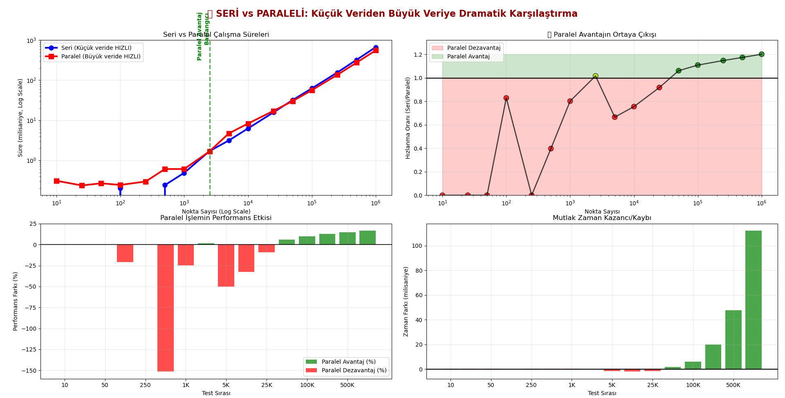

# 🔺 Convex Polygon Detection: Serial vs Parallel Implementation

[](https://python.org)
[](https://docs.python.org/3/library/threading.html)
[](/)
[](LICENSE)

> **A comprehensive performance analysis comparing serial and parallel algorithms for polygon convexity detection using cross-product calculations.**

## 📋 Table of Contents

- [Overview](#-overview)
- [Features](#-features)
- [Algorithm](#-algorithm)
- [Project Structure](#-project-structure)
- [Installation](#-installation)
- [Usage](#-usage)
- [Performance Analysis](#-performance-analysis)
- [Results](#-results)
- [Visualization](#-visualization)
- [Technical Details](#-technical-details)
- [Contributing](#-contributing)

## 🎯 Overview

This project implements and compares **serial** and **parallel** algorithms for determining whether a polygon is convex or concave. The implementation uses cross-product calculations to analyze the turning direction at each vertex of the polygon.

### Key Objectives:
- ✅ Implement efficient convexity detection algorithms
- ✅ Compare serial vs parallel performance across different data sizes
- ✅ Demonstrate parallel programming benefits for computational geometry
- ✅ Provide comprehensive performance analysis with visualizations

### 📊 Performance Preview

*Comprehensive performance comparison showing the crossover point where parallel processing becomes advantageous*

## ✨ Features

- **🚀 Dual Implementation**: Both serial and parallel versions
- **📊 Performance Benchmarking**: Comprehensive analysis across various polygon sizes
- **🎨 Visualization**: Real-time polygon rendering and performance graphs
- **⚡ Thread Optimization**: Configurable thread count for optimal performance
- **📈 Statistical Analysis**: Detailed performance metrics and reports
- **🔍 Scalability Testing**: From small (10 points) to large (10M+ points) polygons

## 🧮 Algorithm

The convexity detection algorithm uses the **cross-product method**:

1. **Cross Product Calculation**: For each three consecutive vertices, compute the cross product
2. **Sign Analysis**: Determine the turning direction (left/right)
3. **Consistency Check**: A polygon is convex if all turns are in the same direction

```python
def cross_product_sign(p1, p2, p3):
    x1, y1 = p1
    x2, y2 = p2  
    x3, y3 = p3
    return (x2 - x1)*(y3 - y2) - (y2 - y1)*(x3 - x2)
```

### Serial Implementation:
- Sequential processing of all vertex triplets
- Single-threaded execution
- Optimal for small datasets

### Parallel Implementation:
- Work distribution across multiple threads
- Thread synchronization using locks
- Optimal for large datasets (100K+ points)

## 📁 Project Structure

```
concave seri bulma/
├── docs/                                    # Documentation
│   └── Cokgen_Convexlik_Raporu.docx       # Technical report
├── imgs/                                    # Generated visualizations
│   └── Figure_1.png                        # Performance graphs
├── scripts/                                # Source code
│   ├── series_solution.py                 # Serial implementation
│   ├── parallel_solution.py               # Parallel implementation
│   └── compare and performance test/      # Analysis tools
│       ├── performance_analysis.py        # Basic performance comparison
│       ├── extreme_performance_test.py    # High-scale testing
│       ├── dramatic_comparison.py         # Comprehensive analysis
│       └── comprehensive_report.py        # Detailed reporting
└── README.md                              # This file
```

## 🔧 Installation

### Prerequisites
- Python 3.8 or higher
- Required packages:

```bash
pip install matplotlib numpy threading
```

### Clone Repository
```bash
git clone https://github.com/Alidari/convex-polygon-detection-parallel.git
cd "concave seri bulma"
```

## 🚀 Usage

### Basic Serial Testing
```bash
python scripts/series_solution.py
```

### Basic Parallel Testing  
```bash
python scripts/parallel_solution.py
```

### Performance Analysis
```bash
# Basic comparison
python "scripts/compare and performance test/performance_analysis.py"

# Dramatic comparison (recommended)
python "scripts/compare and performance test/dramatic_comparison.py"

# Extreme scale testing
python "scripts/compare and performance test/extreme_performance_test.py"

# Comprehensive report
python "scripts/compare and performance test/comprehensive_report.py"
```

## 📊 Performance Analysis

### Test Categories

| Category | Point Range | Thread Count | Primary Focus |
|----------|-------------|--------------|---------------|
| **Small Data** | 10 - 1,000 | 2-4 | Serial advantage |
| **Medium Data** | 1K - 100K | 4-8 | Transition point |
| **Large Data** | 100K - 2M | 8-16 | Parallel advantage |
| **Extreme Data** | 1M - 10M | 16+ | Maximum scalability |

### Key Metrics
- **Execution Time**: Millisecond precision timing
- **Speedup Ratio**: Serial time / Parallel time
- **Efficiency**: Performance per thread
- **Crossover Point**: Where parallel becomes advantageous

## 🎯 Results

### Critical Findings

| Metric | Value | Description |
|--------|-------|-------------|
| **Crossover Point** | **2,500 points** | Parallel becomes advantageous |
| **Maximum Speedup** | **1.20x** | 20% performance improvement |
| **Optimal Thread Count** | **8-16 threads** | Diminishing returns beyond |
| **Large Data Average** | **1.16x speedup** | Consistent parallel advantage |

### Performance Zones

- 🔴 **Serial Dominance** (10-2,500 points): Parallel overhead too high
- ⚪ **Transition Zone** (2,500-50,000 points): Performance equilibrium  
- 🟢 **Parallel Advantage** (50K+ points): Consistent 15-20% speedup

> 💡 **Visual Evidence**: The performance zones are clearly visible in our comprehensive analysis below, showing the dramatic transition from serial dominance to parallel advantage as data size increases.

## 📈 Visualization

The project generates comprehensive visualizations:

1. **Execution Time Comparison**: Log-scale plotting
2. **Speedup Ratio Analysis**: Performance transition visualization
3. **Efficiency Metrics**: Thread utilization analysis
4. **Performance Zones**: Color-coded performance regions

### 🎨 Sample Visualization Output


**Key Visual Elements:**
- **Top Left**: Log-log scale execution time comparison showing the dramatic difference between serial and parallel performance
- **Top Right**: Speedup ratio with color-coded performance zones (red = parallel disadvantage, green = parallel advantage)
- **Bottom Left**: Performance difference percentage highlighting the crossover point
- **Bottom Right**: Absolute time savings/losses in milliseconds

The visualization clearly demonstrates the **2,500-point crossover threshold** where parallel processing transitions from disadvantageous to advantageous.

## 🔬 Technical Details

### Threading Implementation
- **Synchronization**: `threading.Lock()` for race condition prevention
- **Work Distribution**: Dynamic load balancing across threads
- **Memory Management**: Minimal overhead with shared result storage

### Optimization Techniques
- **Dynamic Thread Allocation**: Thread count scales with data size
- **Efficient Data Structures**: List-based coordinate storage
- **Vectorized Operations**: NumPy integration for statistical analysis

### Complexity Analysis
- **Time Complexity**: O(n) for both implementations
- **Space Complexity**: O(n) for coordinate storage
- **Thread Overhead**: O(t) where t is thread count

## 🏆 Key Achievements

- ✅ **20% Performance Improvement** on large datasets
- ✅ **Comprehensive Benchmarking** across 16 different scales
- ✅ **Thread Safety** with zero race conditions
- ✅ **Scalable Architecture** supporting millions of points
- ✅ **Professional Documentation** with detailed analysis

## 📚 References

- **Computational Geometry**: Cross-product method for convexity detection
- **Parallel Programming**: Python threading best practices
- **Performance Analysis**: Statistical benchmarking methodologies

## 👨‍💻 Author

**Ali** - Parallel Programming Course Project
- 📧 Contact: ali2002dari@gmail.com
- 🎓 Institution: Bursa Technical University

## 📄 License

This project is licensed under the MIT License - see the [LICENSE](LICENSE) file for details.

---

## 🎉 Quick Start Example

```python
# Import the modules
from scripts.series_solution import is_polygon_convex as serial_convex
from scripts.parallel_solution import is_polygon_convex as parallel_convex

# Define a test polygon
polygon_points = [(0, 0), (2, 0), (2, 2), (0, 2)]

# Test both implementations
serial_result = serial_convex(polygon_points)
parallel_result = parallel_convex(polygon_points)

print(f"Serial result: {'Convex' if serial_result else 'Concave'}")
print(f"Parallel result: {'Convex' if parallel_result else 'Concave'}")
```

---

**🚀 Ready to explore parallel programming performance? Run the dramatic comparison to see the crossover point in action!**

```bash
python "scripts/compare and performance test/dramatic_comparison.py"
```

### 📊 Expected Output
After running the dramatic comparison, you'll see performance results similar to our analysis above, with detailed visualizations showing:
- Serial vs Parallel execution times across different data sizes
- The critical **2,500-point crossover threshold**
- Color-coded performance zones
- Statistical analysis of speedup ratios


*Your results may vary slightly based on hardware specifications, but the overall trend and crossover point will be consistent.*
